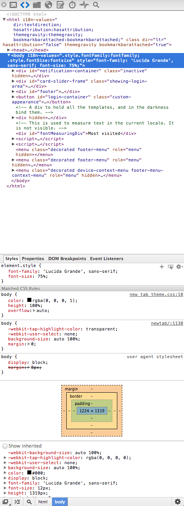

# Custom CSS for Chrome Dev Tools

Surprise web developers! Chrome Dev Tools can be customized with a custom user stylesheet :)

This version has been updated for Chrome Version 27.0.1453.93

## Installation

Place Custom.css in the folder:

### OSX Location

    ~/Library/Application Support/Google/Chrome/Default/User StyleSheets/

### Windows Location

    C:\Users\<username>\AppData\Local\Google\Chrome\User Data\Default\User StyleSheets\

### Linux Location

    ~/.config/google-chrome/Default/User StyleSheets/

## Preview

